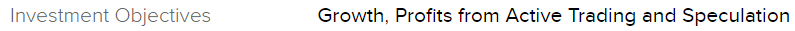

# IB Account Creation
1. Go to the [IB Account creation](https://ndcdyn.interactivebrokers.com/Universal/servlet/Application.ApplicationSelector?ct=US&spltst=www) page and fill in your details
1. When you are asked for your investment objective and level of experience, use the values provided below:
    - Investment Objective: 
    - Experience with various financial products: 
1. Once your IB account is created you can continue with [GCP setup](README.md).
