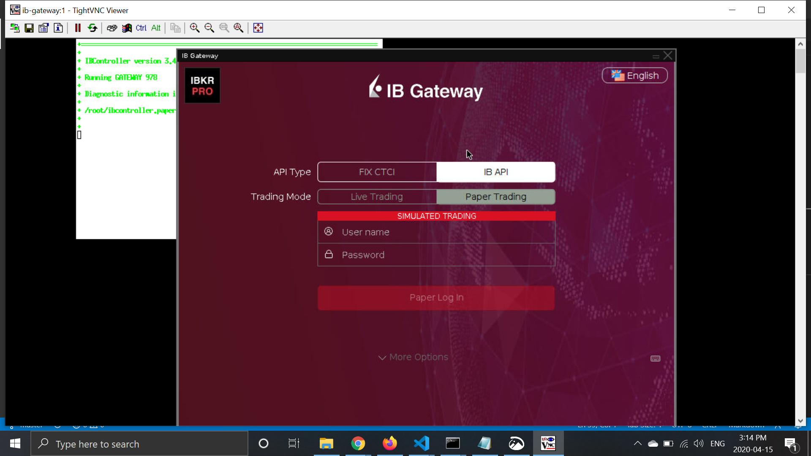

# Interactive Brokers: Headless IB Gateway Installation using IBController on Ubuntu Server

This guide was written for anyone that would like to host an instance of the IB Gateway API on GCP. This will allow you to use libraries like [node-ib](https://github.com/pilwon/node-ib) and [ib-sdk](https://github.com/triploc/ib-sdk) in a production environment.

### Influencers
- https://github.com/roblav96/headless-ib-gateway-installation-ubuntu-server
- https://filipmolcik.com/headless-ubuntu-server-for-ib-gatewaytws/
- https://dimon.ca/how-to-setup-ibcontroller-and-tws-on-headless-ubuntu-to-run-two-accounts/
- https://github.com/QuantConnect/Lean/blob/master/DockerfileLeanFoundation
- https://github.com/QuantConnect/Lean/blob/master/Brokerages/InteractiveBrokers/run-ib-controller.sh
- https://github.com/ib-controller/ib-controller/blob/master/userguide.md

## Set up GCP
*Let me know if there's any way to improve these instructions*
1. Create a [GCP account](https://cloud.google.com/)
1. Create a project called `leverheads`
	- 
1. Make sure you're allowed to create a GCP instance by going to the [VM Instances](https://console.cloud.google.com/compute/instances) page
	- You may see a message saying that you need to Enable Billing. Click the blue "Enable Billing" button to continue.
	- You may see a message saying that you need to Enable the Compute Engine API. Click the blue Enable API button to continue.
1. Open the Cloud Shell (top-right corner of the screen)
	- 
1. Download some necessary files by copy-pasting the below commands into the terminal
```
git clone https://github.com/ronnyli/headless-ib-gateway-installation-ubuntu-server.git
cd headless-ib-gateway-installation-ubuntu-server
```
6. (Optional but recommended) Modify the `config.ini` file so it has your IB username and password.
	- Note to Ronny: finish the instructions for this step
1. Run the `gcloud_commands.sh` script by copy-pasting the below command into the terminal
	- `sh gcloud_commands.sh`
	- The script is done when you see: `Done! You can now access IB through JupyterLab`
1. You'll see a link that looks like `http://localhost:8888/?token=alphanum3r1cstr1ng`. Copy it but replace `localhost` with the External IP address of your new GCP instance.
	1. 
1. You can run any Python code that needs to interact with IB in this JupyterLab setup.



## Create an Interactive Brokers Account
*Instructions TBD*
